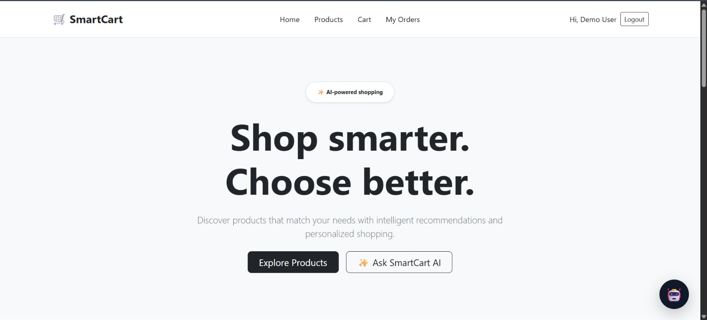
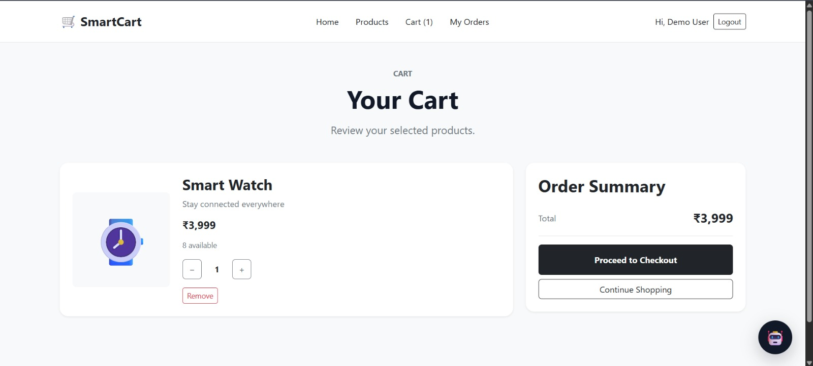
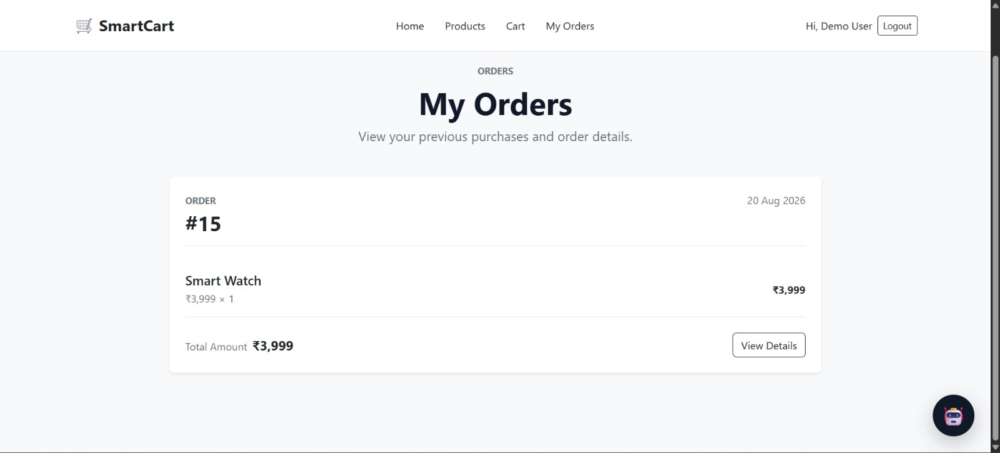
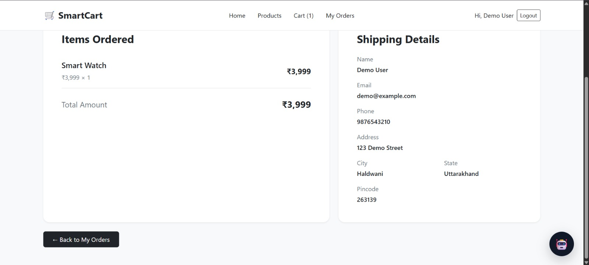

# 🛒 SmartCart — AI-Powered E-Commerce Platform

SmartCart is a full-stack e-commerce web application designed to provide a modern and intelligent shopping experience.

The application includes secure authentication, product browsing, product filtering, shopping cart management, checkout, order processing, stock management, order history, and an AI-powered shopping assistant.

Built with **React, Node.js, Express.js, PostgreSQL, and OpenRouter AI**, SmartCart is deployed using **Render**.

---

## 🚀 Live Demo

### 🌐 Frontend

https://smartcart-frontend-1hm2.onrender.com

### ⚙️ Backend API

https://smartcart-backend-0ybg.onrender.com

### ❤️ Backend Health Check

https://smartcart-backend-0ybg.onrender.com/health

---

## ✨ Features

### 👤 Authentication

- User registration
- User login
- JWT-based authentication
- Protected routes
- User-specific order access
- Logout functionality
- Password hashing using bcrypt

### 🛍️ Product Management

- Browse products
- Product details
- Product pricing
- Product stock availability
- Out-of-stock handling
- Search products
- Category filtering
- Product sorting
- Responsive product cards

### 🛒 Shopping Cart

- Add products to cart
- Remove products from cart
- Increase product quantity
- Decrease product quantity
- Automatic cart total calculation
- Stock-aware cart management
- Cart validation before checkout

### 📦 Order Management

- Checkout system
- Customer shipping information
- Database-backed order creation
- Order item storage
- Automatic order total calculation
- Automatic stock reduction after successful orders
- Order history
- Individual order details

### 🤖 SmartCart AI

- AI-powered shopping assistant
- Product-related questions
- Shopping recommendations
- Product comparison assistance
- Budget-based product selection
- AI-assisted cart actions
- Integrated with OpenRouter API

### 🔐 Security

- JWT authentication
- Password hashing with bcrypt
- Environment variables for sensitive information
- Protected API routes
- User-specific data access
- `.env` files excluded from Git

### ☁️ Deployment

- React frontend deployed on Render
- Node.js/Express backend deployed on Render
- PostgreSQL database hosted on Render
- Production environment variables
- REST API architecture
- Automatic deployment through GitHub

---

## 🛠️ Tech Stack

### Frontend

- React
- Vite
- React Router
- JavaScript
- HTML5
- CSS3
- Bootstrap

### Backend

- Node.js
- Express.js
- REST APIs
- JWT
- bcryptjs
- CORS
- dotenv

### Database

- PostgreSQL
- node-postgres (`pg`)
- pgAdmin

### AI

- OpenRouter API

### Development & Deployment

- Git
- GitHub
- Render
- VS Code

---

## 📸 Screenshots

### 🏠 Home Page



### 🛍️ Products


### 🛒 Shopping Cart



### 📦 My Orders



### 📋 Order Details



### 🤖 AI Shopping Assistant


---

## 🏗️ Project Architecture

```text
                         ┌───────────────────────┐
                         │     React + Vite      │
                         │       Frontend       │
                         └───────────┬───────────┘
                                     │
                                     │ REST API
                                     ▼
                         ┌───────────────────────┐
                         │    Node.js + Express  │
                         │        Backend        │
                         └───────────┬───────────┘
                                     │
                    ┌────────────────┼────────────────┐
                    │                │                │
                    ▼                ▼                ▼
          ┌────────────────┐ ┌───────────────┐ ┌────────────────┐
          │   PostgreSQL   │ │ OpenRouter AI │ │ JWT / bcrypt   │
          │    Database    │ │      API      │ │ Authentication │
          └────────────────┘ └───────────────┘ └────────────────┘